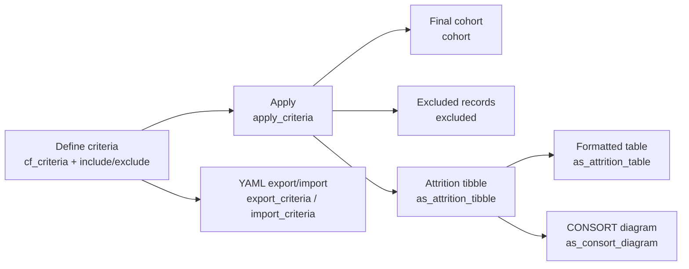

# cohortflow

[](https://github.com/mattmoo/cohortflow/actions/workflows/R-CMD-check.yaml)
[](https://github.com/mattmoo/cohortflow/actions/workflows/lint.yaml)
[](https://codecov.io/gh/mattmoo/cohortflow)
[](https://lifecycle.r-lib.org/articles/stages.html)
[](https://mattmoo.r-universe.dev/cohortflow)
[](https://opensource.org/licenses/MIT)

Define and apply inclusion/exclusion criteria for cohort studies, then generate transparent attrition outputs for reporting.

`cohortflow` helps you:
- Build readable criteria pipelines with formulas or functions
- Apply criteria step-by-step to a dataset
- Extract final cohort and excluded records
- Produce attrition tables as a tibble or formatted table (`flextable`, `gt`, `huxtable`), including per-hierarchy-level CONSORT cluster reporting
- Render a CONSORT-style flow diagram summarising participant flow
- Export/import criteria pipelines as YAML for reproducibility

## Installation

Install from source locally:

```r
install.packages("path/to/cohortflow", repos = NULL, type = "source")
```

Or install from GitHub (replace with your repo path):

```r
# install.packages("remotes")
remotes::install_github("mattmoo/cohortflow")
```

## Quick start

```r
library(cohortflow)

# Example data (a parallel-group RCT). See also mock_crossover(),
# mock_cluster_rct(), and mock_stepped_wedge() for other study designs.
dat <- mock_parallel_rct(n_participants = 200, seed = 1)

# Define criteria pipeline
crit <- cf_criteria() |>
  include(~ !is.na(age),     label = "Age recorded",    category = "Age") |>

  include(~ age >= 18,       label = "Adults only",     category = "Age") |>
  include(~ eligible_screen, label = "Passed screening", category = "Screening") |>
  exclude(~ withdrew,        label = "Withdrew consent")

# Apply criteria
flow <- apply_criteria(dat, crit)

# Get the final cohort
final_dat <- cohort(flow)

# Get excluded rows with step metadata
excluded_dat <- excluded(flow)

# Plain attrition data
attr_tbl <- as_attrition_tibble(flow)

# Formatted attrition table
ft <- as_attrition_table(flow, backend = "flextable")

# CONSORT flow diagram
diagram <- as_consort_diagram(flow)
print(diagram)
```

## Visual output

Example CONSORT flow diagram generated from `as_consort_diagram(flow)`:


Regenerate this figure:

```r
source("scripts/generate_readme_figure.R")
```

## Attrition table backends

`as_attrition_table()` supports:
- `backend = "flextable"` for Word-friendly outputs
- `backend = "gt"` for HTML/LaTeX/Word workflows
- `backend = "huxtable"` for multi-format table output

Optional backends are in `Suggests`, so install the ones you plan to use.

## Grouped attrition tables

For designs with a natural cross-tabulation -- for example a stepped-wedge
trial with sites and periods -- `as_attrition_tibble()` and
`as_attrition_table()` accept `group_x` and `group_y` to repeat the full
attrition block once per group, arranged as columns (`group_x`) and/or row
blocks (`group_y`):

```r
dat  <- mock_stepped_wedge(n_clusters = 6, n_sites = 2, n_periods = 3)
crit <- cf_criteria() |>
  include(~ !is.na(age), label = "Age recorded") |>
  exclude(~ withdrew,    label = "Withdrew consent")
flow <- apply_criteria(dat, crit, id = "event_id")

ft <- as_attrition_table(
  flow,
  backend       = "flextable",
  group_x       = "site_id",
  group_y       = "period",
  group_x_label = "Site",
  group_y_label = "Period"
)
```

Cells can be shaded based on a column (e.g. `pct_removed` or `n_removed`)
via `shade`, or with a custom function via `shade_fn` for full control over
which rows are highlighted and with what colour:

```r
# Shade by percentage removed using a colour ramp
as_attrition_table(flow, shade = "pct_removed")

# Custom rule: highlight steps that removed >5% of the cohort
as_attrition_table(
  flow,
  shade_fn = function(tbl) {
    ifelse(tbl$row_type == "step" & !is.na(tbl$pct_removed) & tbl$pct_removed > 5,
           "#FFCCCC", NA_character_)
  }
)
```

## Hierarchy levels (cluster / within-person CONSORT)

For designs where observational units nest inside a coarser unit -- a
cluster-randomised trial (participants inside clusters) or a within-person
design (trials inside participants) -- pass `hierarchy` to `apply_criteria()`
via `cf_hierarchy()`, then request per-level attrition with `levels`. This is
the reporting form required by the CONSORT cluster extension (Campbell,
Elbourne & Altman, BMJ 2004;328:702-8): losses at each stage counted at both
the unit of analysis and the unit of recruitment.

```r
cl <- mock_cluster_rct(n_clusters = 20, seed = 1)
h  <- cf_hierarchy(participant = "participant_id", cluster = "cluster_id")

crit <- cf_criteria() |>
  include(~ !is.na(age), label = "Age recorded") |>
  group_exclude(by = "cluster_id", ~ dplyr::n() < 10, label = "Cluster too small") |>
  exclude(~ withdrew,    label = "Withdrew consent")

flow_cl <- apply_criteria(cl, crit, hierarchy = h)

# Plain tibble: one stacked block per level
as_attrition_tibble(flow_cl, levels = c("participant", "cluster"))

# Formatted table: one column block per level on the same row
as_attrition_table(
  flow_cl,
  levels       = c("participant", "cluster"),
  level_labels = c(participant = "Participants", cluster = "Clusters")
)
```

Each criterion row reads across both levels at once, e.g. *"Cluster too
small -- 42 participants removed, 3 clusters removed"*. Shading
(`shade`/`shade_fn`) is computed per level. `levels` cannot be combined with
`group_x`/`group_y`/`branch_by`/`count_by`.

## Reproducibility with YAML

```r
# Export criteria pipeline
export_criteria(crit, path = "criteria.yml")

# Re-import later
crit2 <- import_criteria(path = "criteria.yml")
```

## Package workflow at a glance



## License

MIT. See [LICENSE](LICENSE).
