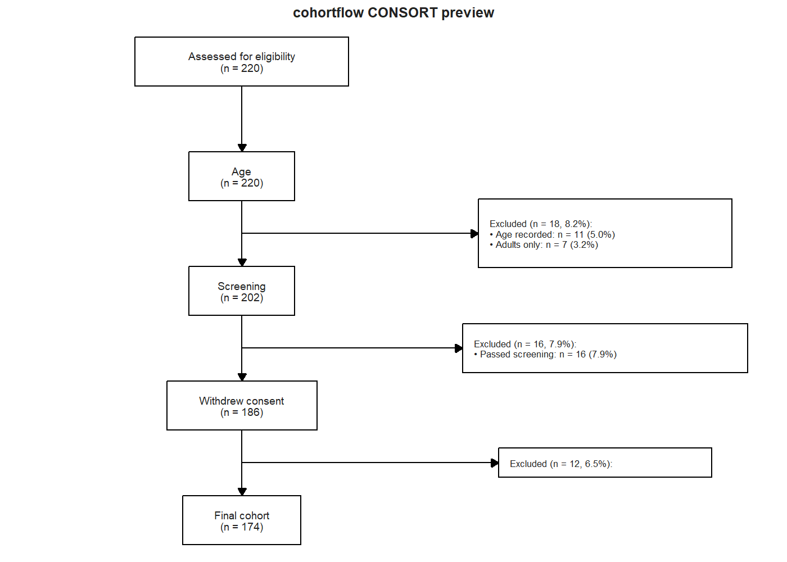
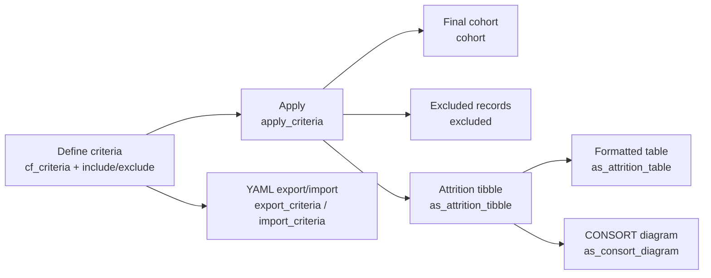

# cohortflow

[](https://github.com/mattmoo/cohortflow/actions/workflows/R-CMD-check.yaml)
[](https://github.com/mattmoo/cohortflow/actions/workflows/lint.yaml)
[](https://codecov.io/gh/mattmoo/cohortflow)
[](https://lifecycle.r-lib.org/articles/stages.html)
[](https://mattmoo.r-universe.dev/cohortflow)
[](https://opensource.org/licenses/MIT)

Define and apply inclusion/exclusion criteria for cohort studies, then generate transparent attrition outputs for reporting.

`cohortflow` helps you:
- Build readable criteria pipelines with formulas or functions
- Apply criteria step-by-step to a dataset
- Extract final cohort and excluded records
- Produce attrition tables as a tibble or formatted table (`flextable`, `gt`, `huxtable`)
- Render a CONSORT-style flow diagram summarising participant flow
- Export/import criteria pipelines as YAML for reproducibility

## Installation

Install from source locally:

```r
install.packages("path/to/cohortflow", repos = NULL, type = "source")
```

Or install from GitHub (replace with your repo path):

```r
# install.packages("remotes")
remotes::install_github("mattmoo/cohortflow")
```

## Quick start

```r
library(cohortflow)

# Example data (a parallel-group RCT). See also mock_crossover(),
# mock_cluster_rct(), and mock_stepped_wedge() for other study designs.
dat <- mock_parallel_rct(n_participants = 200, seed = 1)

# Define criteria pipeline
crit <- cf_criteria() |>
  include(~ !is.na(age),     label = "Age recorded",    category = "Age") |>

  include(~ age >= 18,       label = "Adults only",     category = "Age") |>
  include(~ eligible_screen, label = "Passed screening", category = "Screening") |>
  exclude(~ withdrew,        label = "Withdrew consent")

# Apply criteria
flow <- apply_criteria(dat, crit)

# Get the final cohort
final_dat <- cohort(flow)

# Get excluded rows with step metadata
excluded_dat <- excluded(flow)

# Plain attrition data
attr_tbl <- as_attrition_tibble(flow)

# Formatted attrition table
ft <- as_attrition_table(flow, backend = "flextable")

# CONSORT flow diagram
diagram <- as_consort_diagram(flow)
print(diagram)
```

## Visual output

Example CONSORT flow diagram generated from `as_consort_diagram(flow)`:



Regenerate this figure:

```r
source("scripts/generate_readme_figure.R")
```

## Attrition table backends

`as_attrition_table()` supports:
- `backend = "flextable"` for Word-friendly outputs
- `backend = "gt"` for HTML/LaTeX/Word workflows
- `backend = "huxtable"` for multi-format table output

Optional backends are in `Suggests`, so install the ones you plan to use.

## Reproducibility with YAML

```r
# Export criteria pipeline
export_criteria(crit, path = "criteria.yml")

# Re-import later
crit2 <- import_criteria(path = "criteria.yml")
```

## Package workflow at a glance



## License

MIT. See [LICENSE](LICENSE).
